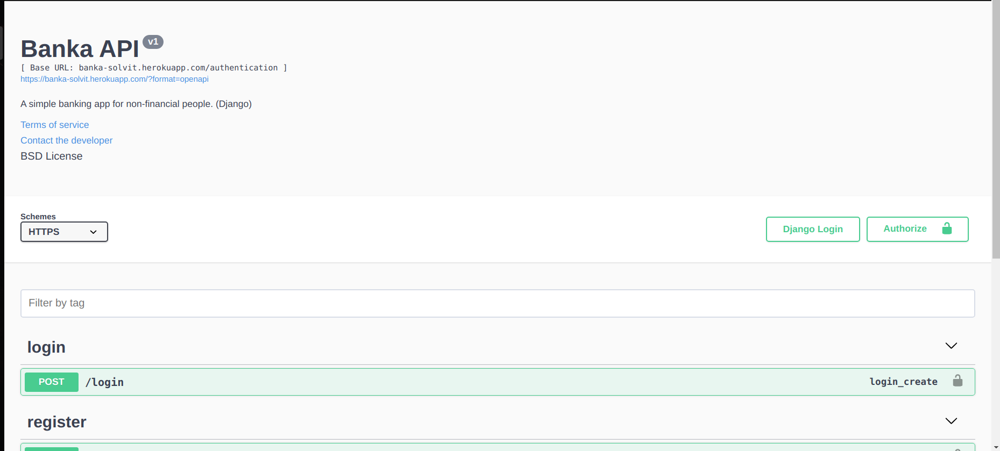

# Banka
### A simple banking app for non-financial people. (Django)

#### How to run this application
1. clone project by `git clone https://github.com/iradtaufique/banka.git`
2. create your `.env file` and configure `SECRET_KEY`, `EMAIL_HOST_USER` and `EMAIL_HOST_PASSWORD`
3. create virtual environment and install the `requirements.txt`
4. run `python manage.py makemigrations` then `python manage.py migrate`
5. run `python manage.py loaddata fixture.json`
6. now run `python manage.py runserver`
>Project Api can be found here https://banka-solvit.herokuapp.com.

